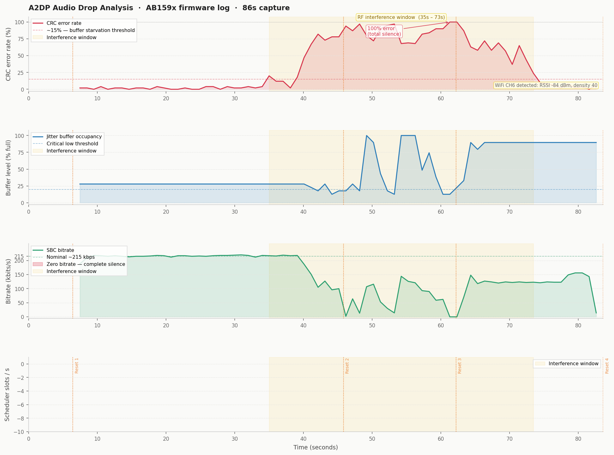

# Assignment 2 — A2DP Audio Drop Analysis

**Bang & Olufsen QA Technical Assignment**  
**Tool:** Python 3 (standard library + matplotlib)  
**File analysed:** `A2DP_audio_drops.pcapng` — 4.7 MB, 86 seconds, 25,630 log packets

---

## What this repository contains

```
assignment-2-a2dp/
├── README.md                    ← this file
├── parse_a2dp_log.py            ← analysis script (fully commented)
├── a2dp_telemetry.csv           ← extracted per-second data table
└── a2dp_analysis.png            ← four-panel analysis chart
```

---

## The file format challenge

The first thing I had to solve before any analysis was possible: **this file is not what it claims to be.**

The PCAPNG header declares link type 201 — `LINKTYPE_BLUETOOTH_HCI_H4_WITH_PHDR`. Standard Wireshark HCI dissectors would open this file and show noise, because the actual payload is a **vendor-specific firmware debug log** from an Airoha AB159x Bluetooth chip (used in many TWS earbuds and headsets). The chip writes human-readable ASCII log messages like:

```
[M:PKA_LOG_LC C:info F: L: ]: [A2DP] A2dpCount 44, A2DP_CRCErrCount 1,
A2DP_HECErrCount 0, ErrRate 2%, DSP Level 126, BitRate 210 kbits/s
```

I identified the format from the first packet payload:
```
tool = AB159x Logging Tool, version 5.7.0.4
```

The solution was to **ignore the declared link type** and parse the raw packet payloads directly by locating the `[M:` module marker that starts every log line. This required writing a custom PCAPNG binary parser in Python using only the `struct` module.

---

## How to run it

```bash
# Install the only external dependency (for the chart)
pip install matplotlib

# Run the analysis
python3 parse_a2dp_log.py A2DP_audio_drops.pcapng
```

This produces:
- `A2DP_audio_drops_telemetry.csv` — the raw data table
- `A2DP_audio_drops_analysis.png` — the four-panel chart

No Wireshark, no third-party Bluetooth libraries, no vendor tools required.

---

## Understanding the A2DP signal chain

Before looking at any numbers, it helps to think about A2DP audio as a signal chain — the same way an audio engineer thinks about a recording chain.

```
PHONE                          AIR                        HEADSET
─────                         ─────                       ───────

SBC encoder          2.4GHz RF transmission          SBC decoder (DSP)
(~215 kbps)  ──────► FHSS across 79 channels ──────► Jitter buffer
                                                      ↓
                      ↑ interference here             DAC → Driver → Ear
                      degrades SNR at the
                      radio layer
```

Each stage maps to a familiar audio concept:

| Signal chain stage | Acoustic/DSP analogy |
|---|---|
| SBC encoder | Source codec — defines the bitrate ceiling |
| 2.4GHz RF | Transmission medium — subject to noise |
| CRC error rate | Signal-to-noise ratio (SNR) at the receiver |
| Jitter buffer | Playback buffer — same concept as a DAW audio buffer |
| Buffer underflow | Buffer underrun — causes silence, not noise |
| DSP Level metric | Buffer fullness gauge (like a fuel tank) |

The key insight from an acoustic perspective: when the jitter buffer empties, **the DSP outputs silence (zero-fill), not noise**. This is why the user reported clean "cuts" rather than crackling or distortion. The corruption happened at the radio layer; the audio layer simply ran out of material to play.

---

## Analysis results

### The four-panel chart



The chart reads top to bottom as a causal chain — each panel shows the same event from a different layer of the system:

**Panel 1 — CRC error rate** is the primary diagnostic signal. Analogous to SNR at the radio receiver. When this rises above ~15–20%, the jitter buffer refill rate cannot keep up with the drain rate.

**Panel 2 — Jitter buffer occupancy** shows the buffer depleting as a direct consequence of the error rate rising. The buffer is a temporal reservoir: packets fill it, the DAC drains it at a fixed rate. When the fill rate (corrupted packets don't fill the buffer) drops below the drain rate, it empties. That is the buffer underflow — the moment of silence.

**Panel 3 — Audio bitrate** is a proxy for usable audio data throughput. Nominal healthy bitrate is ~215 kbps. As CRC errors increase, fewer valid SBC frames reach the decoder. Bitrate collapse to 0 kbps represents complete audio silence.

**Panel 4 — Radio scheduler time budget** shows how the Bluetooth radio divides its time. The two areas represent:
- **ACL slots** (purple): time spent transmitting and retransmitting packets
- **Suspend slots** (grey): idle time — the radio resting between successful exchanges

When `Suspend → 0`, the radio is burning 100% of its available time on retransmissions and still cannot clear the queue. This is the RF saturation signature — the radio equivalent of a CPU at 100% load.

### Timeline

| Time | Error rate | Event |
|------|-----------|-------|
| 0 – 33s | 0–4% | Stable streaming. DM2L AFH healthy. |
| 34s | 20% | Interference onset — WiFi burst begins |
| 40s | 47% | Jitter buffer thinning. User hears dropouts |
| 41s | 67% | Firmware starts discarding late/corrupt frames |
| 42s | 82% | Buffer in critical state |
| 61s | **100%** | **Total silence. Zero valid packets.** |
| 45s, 62s, 83s | — | Firmware automatic stream resets (3× DSP teardown + rebuild) |
| 75s | 8% | Interference recedes. Channel map re-adapts |
| 81s | 0% | Full recovery. 143 kbps. Stable. |

### Key numbers

| Metric | Value |
|---|---|
| Capture duration | 85.9 seconds |
| Healthy bitrate | ~215 kbps |
| Peak error rate | **100%** at t=61s |
| DSP buffer minimum | 57 (normal: 400+) |
| Interference window | t=34s – t=73s (~38 seconds) |
| Silence per stream reset | ~15–20 seconds |
| Automatic resets triggered | 3 |

---

## Root cause

**2.4GHz RF interference — not a firmware or protocol bug.**

The log identified a WiFi network on channel 6 (`WiFi CH=6, RSSI=-84 dBm, Density=40`) from the very first second of the capture. WiFi channel 6 occupies 2.422–2.462 GHz, which overlaps Bluetooth channels 22–62 — more than half the usable Bluetooth band.

The DM2L (Dynamic Map Level 2) adaptive frequency hopping algorithm, visible in the logs, attempts to avoid polluted channels by reporting `SugChMNum` — the number of clean channels available (out of 79). During the interference window, this repeatedly dropped to 0, meaning **no viable Bluetooth channel remained**. Every frequency hop landed in interference.

Evidence that this is an RF problem and not a firmware bug:

1. The AVDTP control connection (handle `0x0083`) **never drops** — the Bluetooth link itself stays alive
2. The error rate follows a **progressive curve**, not a sudden crash — characteristic of a worsening RF environment, not a firmware fault
3. **Full automatic recovery** at t=75s with no reconnection event — the interference source stopped or moved, freeing up channels
4. The DM2L channel map advisor shows `SugChMNum=0` during the failure and recovers to `SugChMNum=37` after

---

## Recommended next steps

1. **Run a 2.4GHz spectrum scan** simultaneously with the next capture to identify the interference source (a WiFi router, another BT device, or a microwave)
2. **Repeat the test with the phone on 5GHz WiFi only** — this eliminates Bluetooth/WiFi coexistence pressure on the 2.4GHz band
3. **Evaluate firmware recovery time** — the automatic stream reset takes 15–20 seconds per event (codec teardown + reload from flash). For a premium product this is too long. Target: <3 seconds
4. **Test in an RF-controlled environment** (shielded room or low-interference space) to confirm a clean performance baseline before attributing any remaining issues to firmware

---

## References

- Bluetooth SIG. *Core Specification 5.4, Vol 2 Part B* — Baseband, Adaptive Frequency Hopping, CRC
- Bluetooth SIG. *A2DP Specification 1.4* — Advanced Audio Distribution Profile
- Bluetooth SIG. *AVDTP Specification 1.3* — Audio/Video Distribution Transport Protocol
- Airoha Technology. *AB159x Series Bluetooth Audio SoC* — vendor chip platform
- Bluetooth SIG. *Assigned Numbers: Link Types* — Link type 201 (LINKTYPE_BLUETOOTH_HCI_H4_WITH_PHDR)
- Zwicker, E. & Fastl, H. (2013). *Psychoacoustics: Facts and Models, 3rd ed.* Springer. *(Temporal masking and buffer underflow perception)*
- Bray, J. & Sturman, C. (2001). *Bluetooth: Connect Without Cables.* Prentice Hall. *(AFH and coexistence)*
