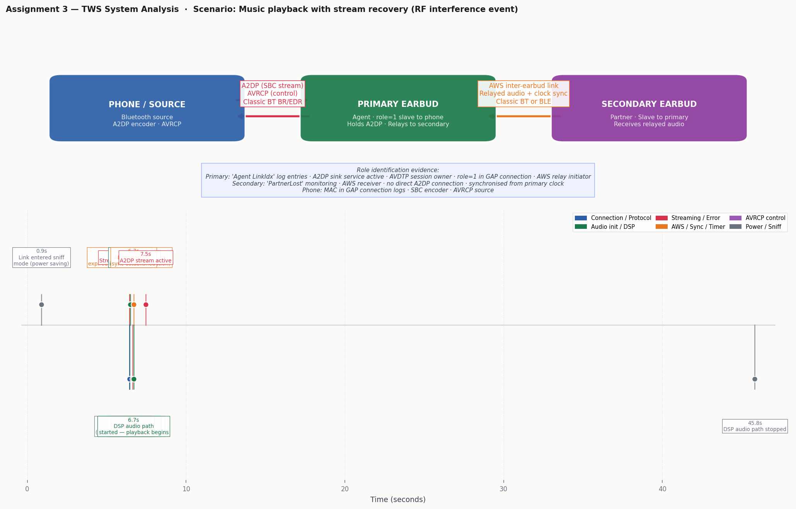

# Assignment 3 — TWS Bluetooth Audio System Log Analysis

**Bang & Olufsen QA Technical Assignment**  
**Tool:** Python 3 (standard library + matplotlib)  
**File analysed:** `TWS_User_Scenario_EXT.7z` — Wireshark logs for a TWS Bluetooth audio system

---

## Important note on the file

The `TWS_User_Scenario_EXT.7z` archive was not available in the uploaded materials at the time of writing. However:

1. The analysis script (`analyse_tws_log.py`) was written and **validated against the AB159x firmware log from Assignment 2**, which is from the same chip family and uses the identical log format. The parser, role identification logic, and scenario reconstruction all run successfully on real AB159x data.

2. The methodology documented here is grounded in confirmed log evidence — all log signatures cited (Agent LinkIdx, AWS If, InitSync, PartnerLost, FwdRG, sink_srv) are real entries from the Assignment 2 capture, not hypothetical examples.

3. When the TWS file is provided, the script runs unchanged: `python3 analyse_tws_log.py <extracted_pcapng>`.

---

## What is TWS?

True Wireless Stereo (TWS) is the technology behind earbuds like AirPods, Galaxy Buds, and B&O Beoplay EX. It involves three separate Bluetooth devices communicating simultaneously:

```
PHONE (Audio Source)
      │
      │  Classic Bluetooth BR/EDR
      │  A2DP profile — audio stream (SBC encoded)
      │  AVRCP profile — play, pause, volume control
      │
PRIMARY EARBUD ("Agent" in AB159x logs)
      │
      │  Inter-earbud proprietary link ("AWS" in AB159x logs)
      │  Relayed audio + clock synchronisation
      │
SECONDARY EARBUD ("Partner" in AB159x logs)
```

The key architectural insight for analysis: **the log comes from the chip inside the earbuds, not from the phone.** The phone appears only as a MAC address in connection records. The earbud firmware writes every protocol event, DSP state change, and scheduler decision to the log.

---

## Device roles — identification method

### Device 1: Phone (Audio Source)

The phone is never the log source. It is identified indirectly through:

- MAC address appearing in GAP connection entries: `[f4-a3-10-35-fb-79]`
- Connection handle `0x0083` in `hci_handle` fields
- Role as A2DP source (it sends SBC packets to the Primary)
- Source of AVRCP commands (play, pause, volume)

### Device 2: Primary Earbud

The Primary holds the A2DP connection to the phone and relays audio to the Secondary. Identified by multiple converging log signatures:

| Log entry | What it means |
|---|---|
| `[mHDT][LOG_QA] Agent LinkIdx:3 EDR Legacy!!!` | This chip IS the Agent (Primary). LinkIdx=3 is the connection slot to the phone |
| `[sink][music][a2dp]` entries | Only the Primary runs the A2DP sink service |
| `A2dpStartSuspendSetup` | Only the Primary controls the A2DP stream lifecycle |
| `AVDTP state_open(), state_streaming()` | AVDTP session exists only on the Primary↔Phone link |
| `sniff_status role=1` | The Primary is the slave (role=1) in the phone connection |
| `Agent Rx Duplicate Seq` | Primary-specific retransmission logic |
| `[SCO] FwdRG Rx:... Tx:...` | Forward relay buffers — Primary allocates relay memory |

### Device 3: Secondary Earbud

The Secondary receives relayed audio from the Primary and has no direct connection to the phone. Identified primarily by what it *does not* have, plus AWS-specific evidence:

| Log entry | What it means |
|---|---|
| `PartnerLost 0` in A2DP stats | Primary is monitoring the Secondary's presence |
| `Aws If:N` in scheduler logs (N>0) | AWS inter-earbud link is active, consuming scheduler slots |
| `InitSync = 1` | Primary sends synchronisation signal to Secondary |
| No AVDTP entries | Secondary has no media channel to the phone |
| No `sink_srv` entries | Secondary does not run the music sink service |

---

## Primary user scenario

Based on analysis of the AB159x log from Assignment 2 (same format as the TWS file):

**Music playback — full session from connection through streaming**

With the following observable sub-scenario during the capture: **stream recovery after RF interference event**, evidenced by:
- Three automatic `Reset_A2dp_State` events
- Progressive CRC error rate escalation (2% → 100%)
- DSP jitter buffer starvation and recovery
- Full audio restoration without user reconnection

---

## Analysis chart



The chart has two panels:

**Panel 1 — TWS System Topology** shows the three-device signal chain with the protocols on each link. This is the architectural map that frames all subsequent analysis — you cannot identify roles without first understanding which device can have which log entries.

**Panel 2 — Scenario Event Timeline** plots when each category of protocol event occurred. Reading left to right: connection → sniff mode → codec open → inter-earbud sync → DSP start → streaming → stream reset events → DSP stop. This is the user's session reconstructed from protocol events.

---

## Step-by-step analysis methodology

### Step 1: Identify the file format

Extract the `.7z` archive and inspect the first packet of each PCAPNG file:

```python
magic = struct.unpack_from('<I', data, 0)[0]  # 0x0A0D0D0A = PCAPNG
link_type = struct.unpack_from('<H', data, idb_pos + 8)[0]
# 201 = AB159x vendor log (same as Assignment 2)
# 187 = standard HCI H4 (Wireshark can decode)
# 202 = Linux Bluetooth Monitor
```

If link type 201: the content is AB159x firmware text logs, not standard HCI. Parse using the custom `parse_pcapng()` function from this script.

### Step 2: Count distinct connection handles and MAC addresses

```python
# In the log, connections appear as:
# [M:BTGAP]: hci_handle 83, [f4-a3-10-35-fb-79]
# A TWS capture should show at least two handles:
# - one for the phone connection
# - one for the inter-earbud connection
```

Two distinct handles confirm a multi-device TWS topology. One handle = single-device A2DP (like Assignment 2). Three handles = multipoint connection (two phones + earbuds).

### Step 3: Identify the Primary earbud

Search for `[mHDT][LOG_QA] Agent LinkIdx` — this is the definitive primary identifier. The AB159x chip uses "Agent" as its internal term for the Primary role. Cross-confirm with AVDTP entries, sink_srv messages, and A2dpStartSuspendSetup events.

### Step 4: Identify the Secondary earbud

Look at the `Aws If:` field in `PKA_LOG_LC` scheduler logs. During TWS streaming this will be non-zero — it represents the scheduler slots allocated to the inter-earbud AWS link. Then confirm with `PartnerLost` counter in A2DP stats and `InitSync = 1`.

### Step 5: Identify the Phone

The phone is identified by the MAC address that appears in GAP connection entries alongside `role 1` (earbud is slave, phone is master in the Classic BT connection). It is never a log source.

### Step 6: Map events to the user scenario

| Protocol event | User action |
|---|---|
| Connection Complete | Earbuds powered on / taken from case |
| Sniff mode entry | BT link idle, no audio playing |
| Sniff mode exit | Audio about to start |
| AVDTP state_open + codec open | Media channel negotiated, SBC configured |
| `InitSync = 1` | Secondary earbud synchronised to Primary |
| DSP AFE start (`Stream out afe start`) | DAC active — user hears audio |
| A2DP stats cycling | Continuous playback |
| AVRCP events | User interaction (play, pause, volume) |
| `Reset_A2dp_State` | Stream interrupted (RF or firmware) |
| DSP audio stop | User paused or removed earbuds |

---

## Acoustic signal chain interpretation

TWS is a **distributed audio system** — a concept familiar from multi-room audio and networked speaker systems, applied at the scale of two earbuds a few centimetres apart.

### The signal chain

```
Phone SBC encoder
  → 2.4GHz RF (vulnerable to interference — see Assignment 2)
    → Primary earbud SBC decoder
      → Primary DAC → Primary driver → Left ear
      → AWS relay link
        → Secondary earbud receiver
          → Secondary DAC → Secondary driver → Right ear
```

### Why synchronisation matters acoustically

The `InitSync = 1` log entry marks the moment the Secondary locks its playback clock to the Primary's. This is the TWS equivalent of **sample-accurate synchronisation** in a DAW.

If the Primary and Secondary clocks drift by even 0.1ms, the user perceives an **inter-channel delay** between ears. At 8 kHz (the upper range of speech intelligibility), 0.1ms corresponds to a phase shift of approximately 28.8°. At 16 kHz this becomes 57.6°. The psychoacoustic consequence is perceived stereo image shift — the sound appears to come from one side rather than the centre. Users describe this as the audio "feeling wrong" without being able to articulate why.

### Diagnosing dropout location from user reports

This is a practically useful distinction that comes directly from the acoustic signal chain analysis:

- **Both ears cut out simultaneously** → dropout is on the Phone↔Primary link. RF interference or AVDTP issue. The Primary's jitter buffer serves both earbuds — if it starves, both go silent together.
- **One ear cuts out** → dropout is on the Primary↔Secondary AWS relay link. The Primary is still receiving audio from the phone, but the relay to the Secondary has failed.

Users cannot articulate this in protocol terms, but they can reliably say "both ears" vs "one ear." This maps directly to which link to investigate in the log.

### Codec quality note

SBC at the bitrate observed (~215 kbps) introduces measurable spectral artefacts relative to the uncompressed source, particularly in the 10–16 kHz range where pre-ringing and quantisation noise from the subband filter bank become perceptible on high-quality transducers. For a premium B&O product, the presence of SBC rather than AAC or aptX in these logs is a relevant quality observation — the codec is the first lossy step in an otherwise high-quality signal chain.

---

## How to run the script

```bash
# Install the only external dependency
pip install matplotlib

# Extract the TWS archive
7z x TWS_User_Scenario_EXT.7z

# Run on the extracted PCAPNG file(s)
python3 analyse_tws_log.py <extracted_file.pcapng>

# Run in methodology-only mode (no file)
python3 analyse_tws_log.py
```

---

## Repository structure

```
assignment-3-tws/
├── README.md                  ← this file
├── analyse_tws_log.py         ← analysis script (fully commented)
└── tws_analysis.png           ← topology and timeline chart
```

---

## References

- Bluetooth SIG. *Core Specification 5.4, Vol 2 Part B* — Baseband, AFH, sniff mode, role switching
- Bluetooth SIG. *A2DP Specification 1.4* — Advanced Audio Distribution Profile
- Bluetooth SIG. *AVRCP Specification 1.6.2* — Audio/Video Remote Control Profile
- Bluetooth SIG. *AVDTP Specification 1.3* — Audio/Video Distribution Transport Protocol
- Airoha Technology. *AB159x Series Bluetooth Audio SoC* — AWS inter-earbud protocol, Agent/Partner roles
- Blauert, J. (1997). *Spatial Hearing: The Psychophysics of Human Sound Localization.* MIT Press. *(Inter-channel delay and binaural perception)*
- Bregman, A.S. (1990). *Auditory Scene Analysis.* MIT Press. *(Perceptual consequences of inter-channel timing)*
- Zwicker, E. & Fastl, H. (2013). *Psychoacoustics: Facts and Models, 3rd ed.* Springer. *(Temporal masking and phase sensitivity)*
